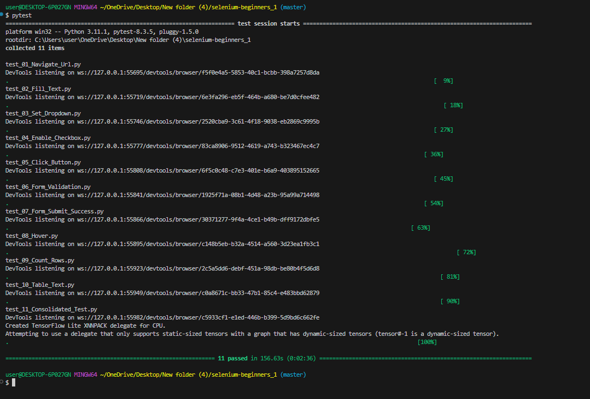

📘 Skill Lab – Day 6 Report
🧪 PyTest, ML Model Testing & Industry Insights
Day 6 of the Skill Lab focused on advanced testing concepts in the field of machine learning using PyTest, alongside gaining valuable industry perspectives from experienced mentors.

🧰 Introduction to PyTest & ML Model Testing
We began by exploring PyTest, a widely-used Python testing framework. Through practical exercises, I learned how to:

Write and organize test cases

Validate outputs from ML models

Ensure model consistency and robustness

Interpret test results to improve model reliability

This hands-on session provided an essential skillset for testing AI/ML applications in real-world scenarios.

👨‍🏫 Mentorship by Avinash Sir & Shivhari Sir
A highlight of the session was the guidance from Avinash Sir and Shivhari Sir, whose engaging mentorship created a supportive and insightful learning environment. They:

Answered questions with clarity and patience

Encouraged critical thinking beyond tutorials

Motivated us to push our boundaries

Their positive energy helped transform complex topics into understandable and actionable lessons.

🧠 Tech Industry Insights
In the second half of the session, the mentors shared key insights into the current tech landscape, focusing on:

Skills that are in high demand

How to prepare for roles in tech companies

Smart strategies for job searching and building confidence

Bridging the gap between academic knowledge and industry expectations

This discussion brought a strong career development angle to the technical content.

💡 Key Takeaways
Gained practical experience with PyTest for ML model validation

Understood testing strategies for ensuring ML reliability

Received expert advice on industry trends and career growth

Felt motivated and more confident about stepping into the tech world

🎯 Outcome
By the end of Day-6, I had improved my skills in ML testing and gained valuable career guidance from seasoned professionals. It was a well-rounded session that blended technical depth with motivational industry exposure.

